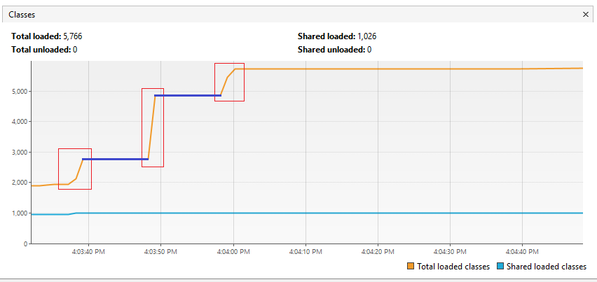
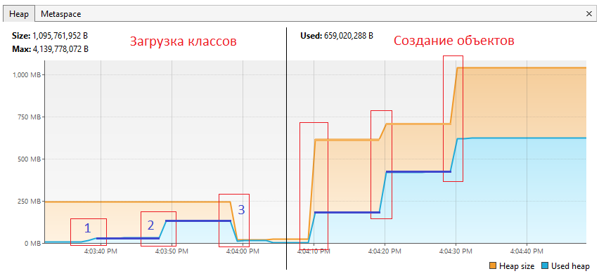
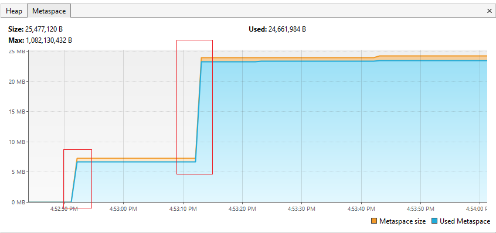

# Задача "Исследование JVM через VisualVM"

## Описание
Предлагается изучить использование памяти через VisualVM при загрузке новых классов и создании новых объектов

## Анализ графиков

Дан код (Код приведен только метода main):
        
        public static void main(String[] args) throws InterruptedException {
            System.out.println("Please open 'ru.netology.JvmExperience' in VisualVm");
            Thread.sleep(10_000);

            loadToMetaspaceAllFrom("io.vertx");
            Thread.sleep(10_000);
            loadToMetaspaceAllFrom("io.netty");
            Thread.sleep(10_000);
            loadToMetaspaceAllFrom("org.springframework");
            Thread.sleep(10_000);

            System.out.println(LocalTime.now() + ": now see heap");
            List<SimpleObject> simpleObjects = createSimpleObjects(5_000_000);
            Thread.sleep(10_000);
            simpleObjects.addAll(createSimpleObjects(5_000_000));
            Thread.sleep(10_000);
            simpleObjects.addAll(createSimpleObjects(5_000_000));
            Thread.sleep(10_000);
        }

1. Анализируя график Classes можно сделать следущие выводы:

* Красными зонами помечены вызовы методов загрузки классов, к которым относятся строки кода:
            
            loadToMetaspaceAllFrom("io.vertx");
            ...
            loadToMetaspaceAllFrom("io.netty");
            ...
            loadToMetaspaceAllFrom("org.springframework");
            ...
* Силними линиями показано ожидания после вызова методов загрузки классов
            
            ...
            Thread.sleep(10_000);
            ...
            Thread.sleep(10_000);
            ...
            Thread.sleep(10_000);

* На графике не отмечен синим третье ожидание потока, т.к. после него загрузки классов не проиходит и график не меняется.

2. Анализируя график Heap можно сделать следующие выводы:

Для анализа график Heap разделим условно на две части:
1. Загрузка классов
2. Создание объектов

* При загрузке классов Heap заполняется объектами, которые создаются в методах поэтому в красных зонах 1 и 2 наблюдаются скачки графика. Стоит отметить, что при запуски строки 

        loadToMetaspaceAllFrom("org.springframework");

    размер используемого хипа и размер самого хипа резко падают, полагаю, это можно объяснить тем, что загрузка классов org.springframework, закончена, поэтому пришел сборщик мусора и очистил хип от созданных ранее служебных объектов.Синими линиями на графике также отмечены вызовы засыпания потока.

* При создании объектов (Правая половина графика) видно, что при вызове методов, которые создают объекты, график используемого хипа идет вверх, а вместе с ним и полный размер хипа увеличивается автоматически. Скачки соответсвуют строкам кода:

            List<SimpleObject> simpleObjects = createSimpleObjects(5_000_000);
            ...
            simpleObjects.addAll(createSimpleObjects(5_000_000));
            ...
            simpleObjects.addAll(createSimpleObjects(5_000_000));
            ...

* Синими линиями на графике также отмечены вызовы засыпания потока.

3. Анализируя график Heap можно сделать следующие выводы:
   

* При запуске программы происходит загрузка необходимых системных классов и классов программы, поэтому мы видим скачек.
* Дальше программа работает какое-то время и используемое пространство в метаспейсе не меняется.
* Второй красный подъем произошел на вызове строки

        loadToMetaspaceAllFrom("org.springframework");

Это говорит о том, что произошла дополнительная подгрузка классов.